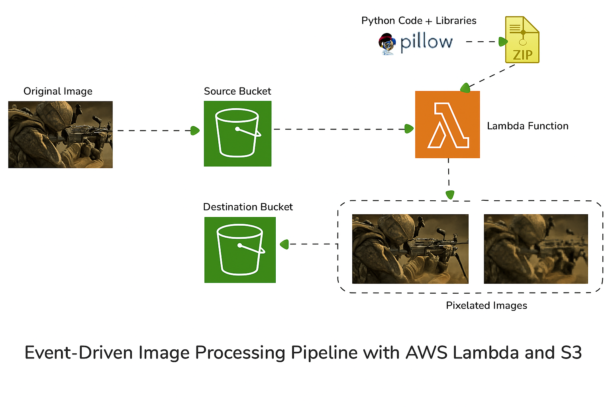
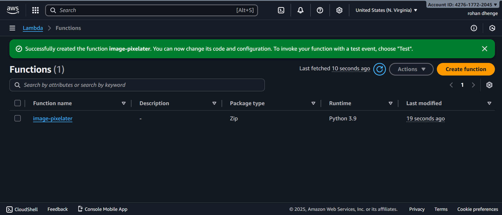
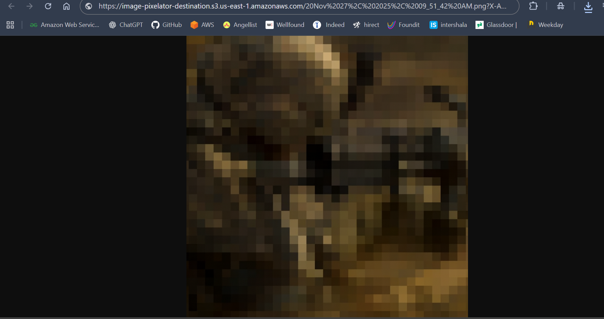

 # Event-Driven Image Processing Pipeline with AWS Lambda and S3
This project demonstrates how to build an automated, event-driven image processing pipeline using AWS Lambda and S3. When an image is uploaded to a source S3 bucket, an AWS Lambda function is triggered, which processes the image by pixelating it into  different resolutions using the Pillow (PIL) library. The processed images are then stored in a processed S3 bucket. This project leverages a fully serverless architecture, ensuring scalability and cost-effectiveness.

## What You Will Learn:
* AWS Lambda Event-Driven Architecture: How to trigger Lambda functions in response to S3 events.
* Image Processing with Python (Pillow Library): Techniques for manipulating images, including pixelation.
* S3 Bucket Operations: How to manage objects across multiple S3 buckets, including permissions and event notifications.
* Error Handling and Optimization: Implementing best practices for error handling in Lambda functions.
* Serverless Deployment: Experience deploying a fully serverless pipeline on AWS, ideal for real-time, automated tasks.

## Where Pixelation is Used:
Pixelation can be useful in several scenarios, including:

* Privacy Protection: Pixelating parts of images, such as faces or sensitive areas, is often used in media or public content to anonymize individuals.
* Creative Design: Pixelated images are popular in retro or abstract art, game design, and for stylized visual effects.
* Data Reduction: In applications where reduced image resolution is needed for quick previews or when bandwidth is limited, pixelation can be used to create smaller image files.
* Video and Image Compression: Pixelated previews are useful in scenarios where image or video quality can be progressively enhanced as more data is loaded.
* Blur Detection and Machine Learning: Pixelation can also be used in preprocessing images to test machine learning models on recognizing shapes, patterns, or when reducing visual noise is necessary for certain types of analysis.

## Project Solution:

### Stage 1: Create the S3 Buckets
  * Bucket 1: image-pixelater-source
  * Bucket 2: image-pixelater-processed

  

### Stage 2: Develop the Lambda Function Code:
  * Create a folder named my_lambda_deployment.
  * Move into that folder (cd my_lambda_deployment).
  * Create a folder called lambda.
  * Move into that folder (cd lambda).
  * Create a file called lambda_function.py and paste in the code for the pixelator
  * Run unzip Pillow,the Pillow module files required for image manipulation in Python 3.9 (which the lambda function will be using).
  * From the same folder, run zip -r ../my-deployment-package.zip . which will create a lambda function zip, containing all these files in the parent directory.
  * This zip will be the same zip which is linked below, so if you have any issues with the lambda function, you can use the one that's pre-created.

  

### Stage 3 - Create and Configure the Lambda Function

### Stage 4 - Test and Monitor

## Uploaded Image

## Pixel Image

## Outcome:
By the end of this project, you will have a complete event-driven image processing pipeline capable of automatically pixelating images at multiple resolutions, with the processed images stored in a separate S3 bucket. This architecture is scalable, efficient, and can be adapted for other image processing tasks, providing a practical example of serverless computing in action.